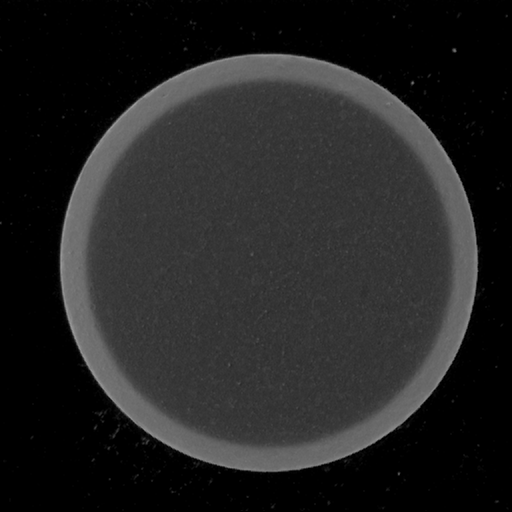
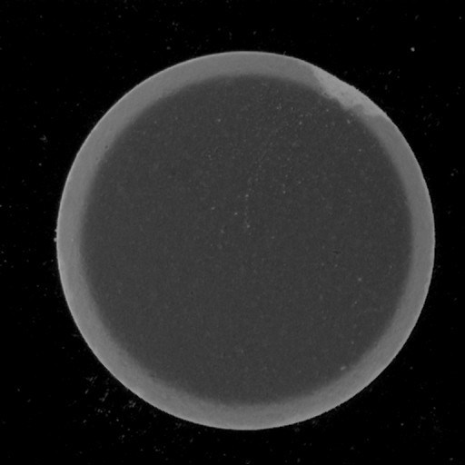

  

# Pill Defects

This dataset1 comprises images depicting *normal* (i.e., no defects) and *defective* pills. The data could be used to build and train an ML model that can detect manufacturing defects during pill production.

# Structure

This repo contains the following structure:

- **/defect**: subdirectory containing images depicting defective pills.
- **/normal**: subdirectory containing images depicting normal pills.
- **data.csv**: CSV file for use in loading the data into PerceptiLabs. This file maps each image to a classification label of **normal** or **defect**.

The following shows a partial example of the data stored in **data.csv** that is used to load the data into PerceptiLabs. The values in the **labels** column indicate the respective classification depicted in each image.

| **image_path** | **target** |
|------------|--------------|
| defect/pic.6.1561.0.png | defect |
| defect/pic.6.1562.0.png | defect |
| normal/pic.6.443.0.png | normal |
| normal/pic.6.444.0.png | normal |

The following shows a couple of example of images from the dataset:

  
  

The left image shows a *normal* pill and the right image shows a *defective* pill.

# Community

Got questions, feedback, or want to join a community of machine learning practitioners working with exciting tools and projects? Check out our [Community](https://forum.perceptilabs.com/)!

1 Dataset Credits: https://www.kaggle.com/pudpawat/pill-defect-dataset
